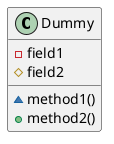
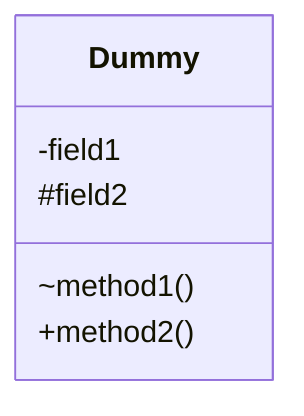

# exemplo de diagrama de classes com PlantUML

```plantuml
@startuml

class Dummy {
 -field1
 #field2
 ~method1()
 +method2()
}

@enduml
```
# exemplo de diagrama de classes com Mermaid

```mermaid
classDiagram
class Dummy {
  -field1
    #field2
    ~method1()
    +method2()
}
```

